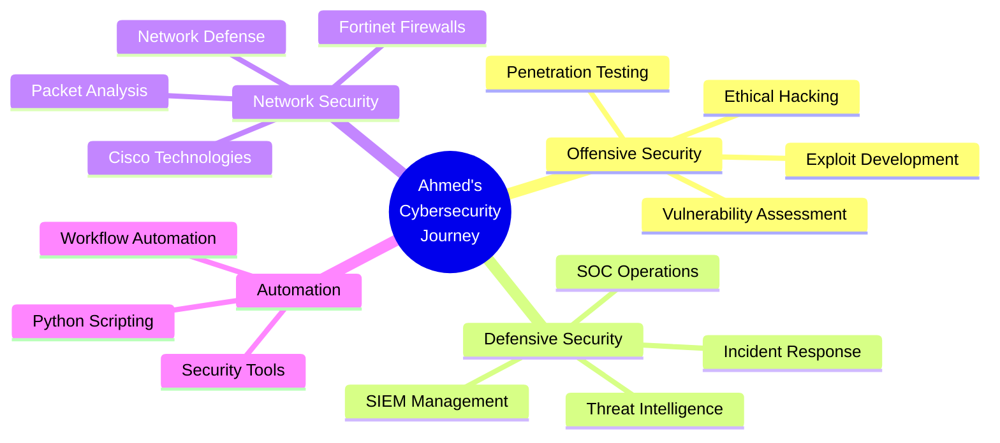
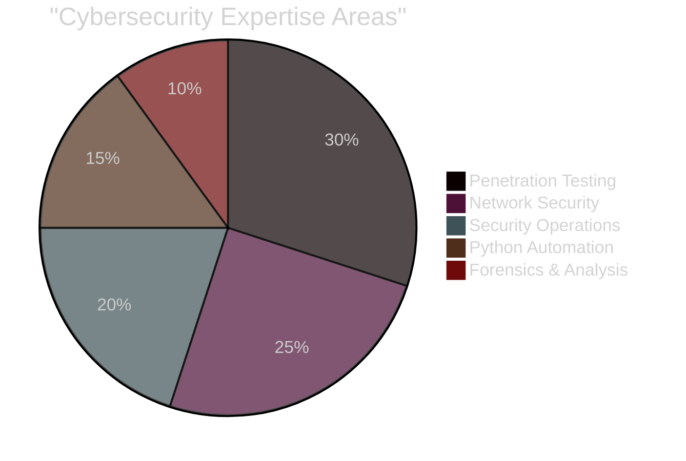

<div align="center">
  
</div>

<h1 align="center">
  
</h1>

<div align="center">
  
  
</div>

<br/>

<p align="center">
  
</p>

---


### 🛡️ About Me

- 🎓 Third-year **Cybersecurity Student** at Alexandria National University
- 📊 **GPA: 3.45** - Strong Academic Performance
- 🔐 Specialized in **Penetration Testing** & **Ethical Hacking**
- 🏆 **20+ Professional Certifications** including eJPT & SANS450
- 🔥 Trained at **ITI** and **NTI** with real-world experience
- 🐍 Expert in **Python Security Automation**
- 🌐 **Network Security Specialist** with Fortinet expertise
- 💼 SOC Level-1 workflows & Threat Analysis
- 📍 Based in **Beheira, Egypt**

<br clear="right"/>

---

### 🔧 Technical Arsenal

<div align="center">

#### 💻 Programming & Scripting


#### 🛠️ Cybersecurity Tools
<p>


</p>

#### 🌐 Networking & Systems
<p>


</p>

#### ☁️ Cloud & Virtualization
<p>


</p>

</div>

---

### 📊 Core Competencies

<div align="center">

```ascii
╔═══════════════════════════════════════════════════════════════╗
║           CYBERSECURITY PROFESSIONAL PROFILE                  ║
║                      Ahmed Alsayed                            ║
╚═══════════════════════════════════════════════════════════════╝

┌─────────────────────────────────────────────────────────────┐
│  👤 Identity                                                 │
├─────────────────────────────────────────────────────────────┤
│  Name: Ahmed Alsayed                                        │
│  Role: Cybersecurity Student & Penetration Tester           │
│  Location: Beheira, Egypt                                   │
│  University: Alexandria National University                 │
│  GPA: 3.45 | Year: Third Year                              │
└─────────────────────────────────────────────────────────────┘

┌─────────────────────────────────────────────────────────────┐
│  🎯 OFFENSIVE SECURITY                                       │
├─────────────────────────────────────────────────────────────┤
│  • Web Application Security Testing                         │
│  • Network Penetration & Exploitation                       │
│  • Vulnerability Assessment & Management                    │
│  • Social Engineering Techniques                            │
│  • Exploit Development & Mitigation                         │
│                                                             │
│  Tools: Burp Suite Pro | Metasploit | OWASP ZAP            │
└─────────────────────────────────────────────────────────────┘

┌─────────────────────────────────────────────────────────────┐
│  🛡️ DEFENSIVE SECURITY                                       │
├─────────────────────────────────────────────────────────────┤
│  • SOC Level-1 Analyst Workflows                            │
│  • SIEM Management (Splunk)                                 │
│  • Security Incident Response                               │
│  • Threat Hunting & Intelligence                            │
│  • Log Analysis & Correlation                               │
│  • FortiAnalyzer Implementation                             │
│  • Cyber Threat Intelligence (CTI)                          │
└─────────────────────────────────────────────────────────────┘

┌─────────────────────────────────────────────────────────────┐
│  🌐 NETWORK SECURITY                                         │
├─────────────────────────────────────────────────────────────┤
│  • Fortinet Firewall Management (89% Score)                 │
│  • IDS/IPS Configuration & Tuning                           │
│  • Secure Network Architecture Design                       │
│  • Packet Analysis (Wireshark)                              │
│  • Cisco IOS Security Hardening                             │
│  • Zero Trust Network Implementation                        │
└─────────────────────────────────────────────────────────────┘

┌─────────────────────────────────────────────────────────────┐
│  🔬 DIGITAL FORENSICS                                        │
├─────────────────────────────────────────────────────────────┤
│  • Autopsy Digital Forensics                                │
│  • Incident Investigation & Response                        │
│  • Malware Reverse Engineering                              │
│  • Network Forensics Analysis                               │
│  • Timeline Analysis & Reconstruction                       │
└─────────────────────────────────────────────────────────────┘

┌─────────────────────────────────────────────────────────────┐
│  🐍 AUTOMATION & SCRIPTING                                   │
├─────────────────────────────────────────────────────────────┤
│  • Python Security Automation Scripts                       │
│  • Custom Exploitation Tools Development                    │
│  • Bash Shell Scripting                                     │
│  • PowerShell Automation                                    │
│  • Vulnerability Scanners                                   │
└─────────────────────────────────────────────────────────────┘

┌─────────────────────────────────────────────────────────────┐
│  🏆 ACHIEVEMENTS & CERTIFICATIONS                            │
├─────────────────────────────────────────────────────────────┤
│  ✓ eJPT - Junior Penetration Tester                        │
│  ✓ SANS450 - Security Essentials                           │
│  ✓ CCNA - Cisco Certified Network Associate                │
│  ✓ Azure AZ-900 Fundamentals                               │
│  ✓ Red Hat Certified System Administrator                  │
│                                                             │
│  📜 Total: 20+ Professional Certifications                  │
│  🎓 Training: ITI & NTI Institutes                          │
│  💯 Fortinet Score: 89%                                     │
└─────────────────────────────────────────────────────────────┘

    ╔═══════════════════════════════════════════════════════╗
    ║  🔐 Cybersecurity Student & Penetration Tester        ║
    ║  🏆 eJPT & SANS450 Certified | 20+ Certs              ║
    ║  🎯 Offensive & Defensive Security Specialist         ║
    ║  🐍 Python Security Automation Expert                 ║
    ║  🌐 Network Security Specialist (Fortinet 89%)        ║
    ║  🛡️ SOC Analyst | Threat Hunter | Incident Responder ║
    ╚═══════════════════════════════════════════════════════╝
```

</div>

---

### 🏅 Certifications & Achievements

<div align="center">

<table>
<tr>
<td width="50%" valign="top">

#### 🎯 Elite Certifications
| Cert | Issuer | Year |
|------|--------|------|
| 🏆 **eJPT** | INE/eLearnSecurity | 2024 |
| 🔐 **SANS450** | SANS Institute | 2024 |
| 🌐 **CCNA** | Cisco | 2024 |
| ☁️ **AZ-900** | Microsoft | 2024 |
| 🔴 **RHEL Admin** | Red Hat | 2024 |

</td>
<td width="50%" valign="top">

#### 🛡️ Recent Achievements
| Cert | Issuer | Year |
|------|--------|------|
| 🎓 **Fortinet** (89%) | NTI | 2025 |
| 🔒 **ISO 27001** | SkillFront | 2025 |
| 🕵️ **Defensive Ops** | Cybrary | 2025 |
| 📊 **Threat Intel** | arcX | 2025 |
| 👨‍🏫 **CCEP** | Red Team Leaders | 2025 |

</td>
</tr>
</table>


</div>

---

### 🎯 Focus Areas



---

### 💼 Training & Experience

🎓 **Information Technology Institute (ITI)** - Cybersecurity Training
- Hands-on penetration testing and ethical hacking
- CTF challenges and security competitions
- Real-world attack simulation and defense strategies

🎓 **National Telecommunication Institute (NTI)** - Fortinet Specialization
- Fortinet firewall configuration and management
- Advanced network security policy implementation
- SIEM integration with Fortinet ecosystems

---

### 📈 GitHub Journey

<div align="center">
  


#### 🚀 Building My Cybersecurity Portfolio

```ascii
┌─────────────────────────────────────────┐
│  📦 Security Tools & Scripts            │
│  🔐 CTF Writeups & Walkthroughs         │
│  🛡️ Penetration Testing Frameworks      │
│  🐍 Python Security Automation          │
│  📚 Learning Resources & Notes          │
└─────────────────────────────────────────┘
```


</div>

---

### 📊 Skills Distribution

<div align="center">



</div>

---

### 🤝 Connect With Me

<div align="center">
  
<a href="https://www.linkedin.com/in/ahmed-alsayed-albanna">
  
</a>
<a href="mailto:ahmdalsydalbna555@gmail.com">
  
</a>
<a href="https://github.com/AhmedAlsayedalbana">
  
</a>
<a href="https://tryhackme.com/p/AhmedAlsayedalbana">
  
</a>
<a href="https://app.hackthebox.com/profile/AhmedAlsayedalbana">
  
</a>

</div>

---

### 📝 Latest Projects & Contributions

<div align="center">

```ascii
┌─────────────────────────────────────────────────────────────┐
│  🔬 Research: Advanced Penetration Testing Techniques       │
│  🛠️ Building: Custom Security Automation Tools              │
│  📖 Learning: Advanced Exploit Development                  │
│  🎯 Goal: Become a Certified Penetration Testing Expert     │
└─────────────────────────────────────────────────────────────┘
```

</div>

---

### 🎮 Capture The Flag Profiles

<div align="center">

<a href="https://tryhackme.com/p/AhmedAlsayedalbana">
  
</a>
<a href="https://app.hackthebox.com/profile/AhmedAlsayedalbana">
  
</a>

<br/><br/>


</div>

---

<div align="center">
  
### 💭 Cybersecurity Quote
  


</div>

---

<div align="center">
  


**⭐️ From [Ahmed Alsayed](https://github.com/AhmedAlsayedalbana) | Made with 🔐 and ❤️**

</div>
